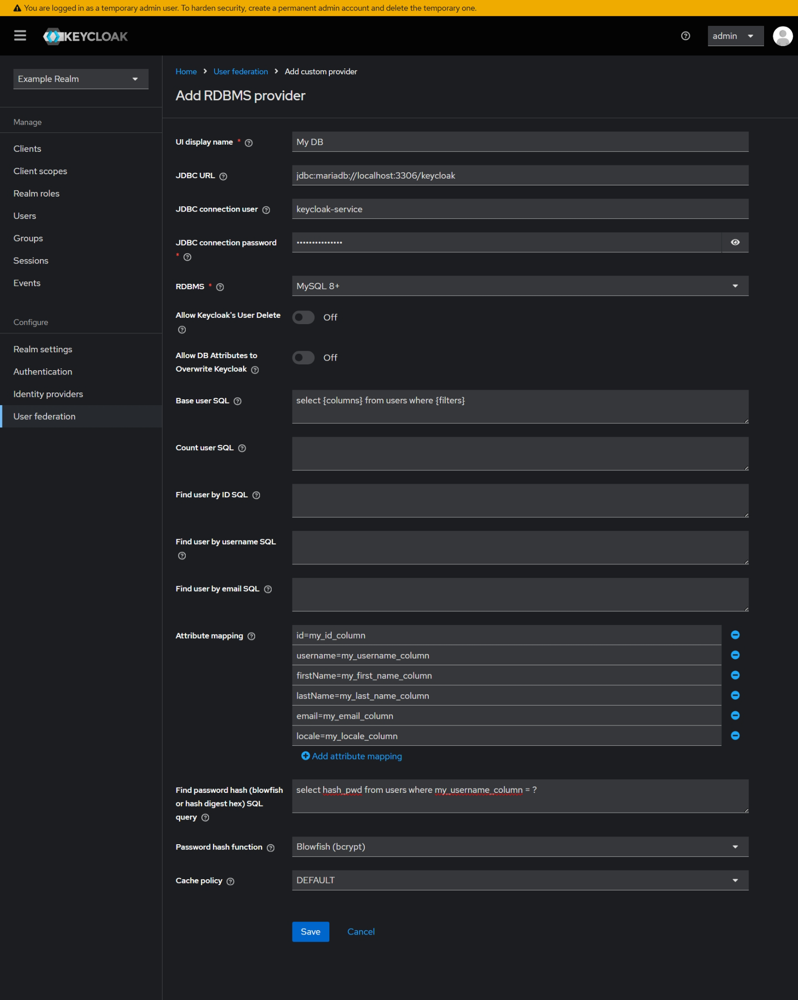
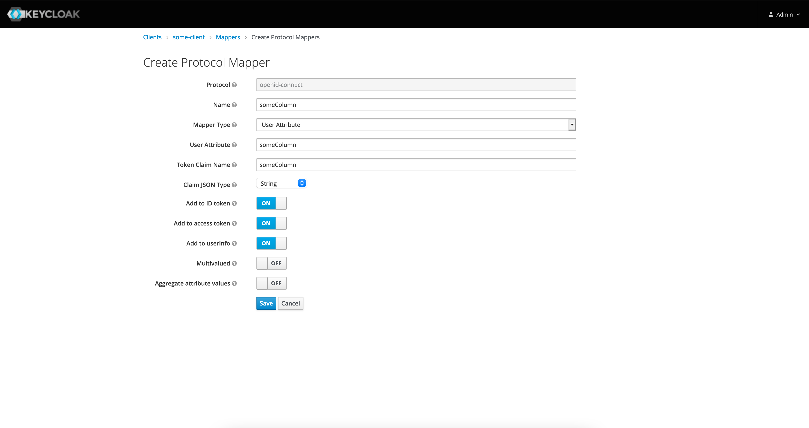

# singular-keycloak-database-federation

Keycloak User Storage SPI for Relational Databases (Keycloak User Federation). 
Supports MySQL 8+, SQL Server 2012+.
PostgreSQL, Oracle, and DB2 drivers are included but not officially supported.

## Changes
Changes from the forked repo:
- Changed provider configuration
- Added support for attribute-based search
- Fixed user search in authorization evaluation test
- Added support for password updates


## Configuration

Keycloak User Federation Screenshot




## Limitations

- Do not allow user information updates
- Do not support user roles or groups

## Custom attributes

Just add a mapper to client mappers with the same name as the returned column alias in your queries. Use mapper type "User Attribute". See the example below:
    



## Build

- Run `mvn clean package`  

## Development

- Copy `.env.example` to `.env` and adjust the values as needed
- Run `docker compose up`

## Deployment

- Copy every  `.jar` from `target/` and `target/deps/` folder to `/providers` folder under your keycloak installation root. 
- Run:
    `$ ./bin/kc.sh start-dev`
    OR if you are using a production configuration:
    ```bash
    $ ./bin/kc.sh build
    $ ./bin/kc.sh start
    ```

## For futher information see:
- https://github.com/keycloak/keycloak/issues/9833
- https://www.keycloak.org/docs/latest/server_development/#packaging-and-deployment
